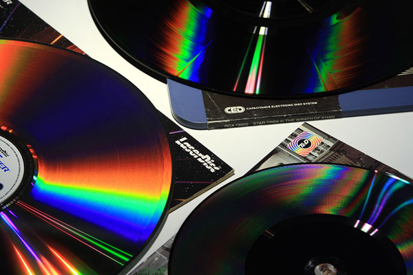
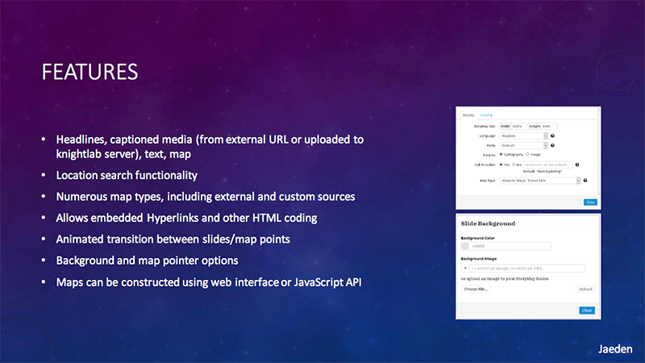
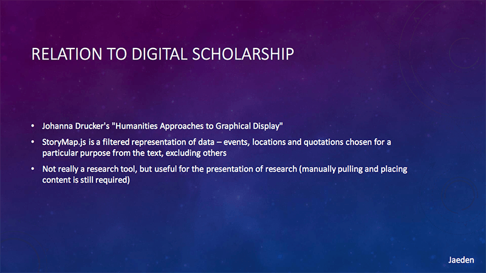
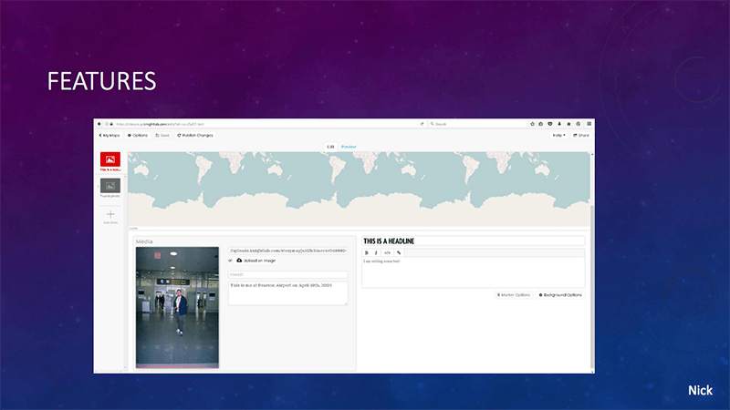

# IASC 2P02 | Jaeden Laffey

### About Me

My name is Jaeden Laffey, and I am a second year student in Interactive Arts and Science at Brock and I'm also taking a business minor. The areas of research & specialization within the field of Digital Humanities that I feel I am most interested in is Media Archeology.  I have always been interested in the research of old “new” media, the evolution of technology, and the study of pop culture.  I think that this interest can be seen in much of my work that I have completed this past year.  Media Archeology was the basis for my research presentation on Capacitance VideoDiscs.  For the project I showcased a forgotten and quite unique video format and I discussed its technology, its uses, the historical value, and how the format can be re-used or re-purposed today. As I am only halfway through my journey at Brock, I don’t feel that I yet have full expertise in the field, and I plan to continue to study and am excited to learn more about my areas of specialization throughout my 3rd and 4th years at Brock.  

### Featured Project

### [The Forgotten VideoDiscs: Revised](reveal_final_revised_jaeden/index.html)

**Abstract**

My research presentation was about the long-lost video format; Capacitance VideoDiscs, RCA’s CED (Capacitance Electronic Disc) and JVC’s VHD (Video High Density).  I am very interested in consumer media & entertainment (particularly music and film), as well as the evolution of media technologies that we use.  For this reason, I wanted to focus on a forgotten video format. I originally was planning on delivering my presentation on Sony’s Betamax and new uses for cassette tapes, but during my research, I came across an article online mentioning Capacitance VideoDiscs and the uniqueness and rarity of this format and the technology behind it instantly captured my interest. The VHD & CED were record-style discs that used the method of Capacitance to store and playback audio and video.  Capacitance is the ability of two adjacent conductors to store electric charge.  In the videodisc, the adjacent conductors are the carbon-loaded disc and the titanium electrode in the stylus that reads the disc like a record.  These discs and the machines used to play them were quite cheap to manufacture, contained less complicated machinery and were sold for prices almost half of VHS, thus making them an appealing alternative video format.  They were (and still are) the only 2 formats to use this technology, which is what makes them quite unique.  Prior to the research that I did for this assignment I had never heard of Capacitance VideoDiscs, but what I have learned about the technology taught me a lot and made me very curious as to why it didn’t succeed, how we could have built upon this technology, and the possible alternative uses of the technology.  

**Revision**

In the feedback that I was given, it came to my attention that my original presentation contained too much writing on screen, and this compromised the communication skills of the Pecha Kucha presentation due to on-screen clutter.  To solve this I added presentation notes to my reveal.js slides, (which are accessed by pressing the “s” key while the presentation is open) and I reformatted each slide to contain as little text as possible while still being able to convey all relevant information to the audience.  My presentation notes now contain relevant presentation information for me to relay to the audience during the presentation, and allow for more efficient oral and visual communication of the material to the audience.  
In my feedback for the project, it was also brought to my attention that I had re-used the same images a few times. This created an issue because when presenting, the lack of visual accommodation made the presentation less visually stimulating for the audience and made it harder to follow along and fully understand the content. As a result of this I ended up finding some new photos to use in my presentation that better reflected the topics at hand, and I created some graphics in Photoshop to visually demonstrate the points that are being discussed in my dialogue of the presentation. I also re-formatted the layouts of my slides to better showcase my research visually and reflect the information I was trying to convey on each slide. After this, I re-arranged the slides in a way that better explains the CED and VHD by first talking introducing the product, then giving information about the background of the product, its development, and how the tech worked before giving details (such as size, storage capacity, etc) about the videodiscs themselves.  

### Academic Blog
[What Is Digital Humanities Doing in English Departments?](blog)

### Research Presentation
[The Forgotten VideoDiscs (Revised)](reveal_final_revised_jaeden/index.html)

[The Forgotten VideoDiscs (Original)](reveal_final_jaeden/index.html)

### Collaborative Presentation
[Storymap.js (feat. Caleb, Nick, & Ian)](IASC2P02_GroupPresentation.pdf)

**Project Description** 

The digital humanities tool that I had the opportunity to use for our collaborative project was Storyboard.js, by Knight Labs.  This tool allows users to display information in a linear narrative overtop of a map.  Storymap.js allows users to pick pinpoints on a map and create slides with text, images, and embedded links in a PowerPoint style layout.  Each slide is attached to a location, and as the slides progress the locations on the map change accordingly to give a visual geographic representation of information as the user progresses forwards in their story or presentation.  To test out the Storymap.js, I created for myself a basic presentation of all of the places I’ve travelled to, in order to familiarize myself with how to use the tool.  After that, our group created a Storymap for our in-class presentation, which we based on the novel “Underground to Canada” by Barbara Smucker, which retold the storyline of the book, following escaped slaves slide-by-slide as they made their way from Virginia all the way to St. Catharines.  

**Screenshots From Our Presentation**

**Collaboration Statement**

Collaboration can greatly enrich my academic thinking.  Working in a group allows for members to receive feedback for the work they’ve done and fix and errors they may have made or overlooked.  Working in a group also allows for the sharing of more creative ideas, as working with others allows for more input for solving problems as people with different opinions, ideas, and methodologies to intermingle and share their thoughts, allowing for ideas that one person might not have been able to think of by themselves.   

When working in a team, one digital material that is of great use is online collaborative workspaces such as Google Docs/Slides or Powerpoint Online.  One approach that we took while collaborating on this project was splitting up the work into sections, and allowing each person to focus on the specific aspect of research that we want, and trying to find answers individually.  After we did this we would return as a group, share our ideas and let others provide us with feedback and allow other to share their ideas for the topics we covered.  At the end of this, we all were able to contribute our own ideas and build upon the ideas presented by others to create our final presentation.   

These online services allow for all group members to be able to contribute and give creative input to the final project.  Additionally, these services allow group members to be able to contribute at any time, from any place, and no longer limits us to only working within class time which is great for sharing an important idea that is thought up outside of class time, or for people who work better in different classroom settings.  

