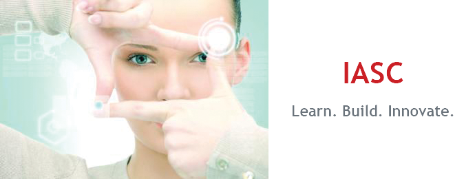

# IASC 2P02 | Jaeden Laffey

### About Me

I am a second year student in Interactive Arts and Science at Brock and I'm also taking a business minor.   I'm really interested in sports media, music, and film and I'm a Raptors fan.  

### Featured Project

### "[The Forgotten VideoDiscs: Revised]()"

**Abstract**
Lorem ipsum dolor sit amet, consectetur adipiscing elit. Praesent at lorem ultricies, volutpat velit vel, facilisis turpis. Donec id consectetur risus, vel commodo sapien. Nam gravida luctus ante non ornare. Pellentesque finibus metus quis diam tempus, ac scelerisque ipsum volutpat. Donec id cursus dolor, at ultrices tellus. Fusce nec mauris nec mi tempus accumsan. Nam venenatis euismod quam, varius iaculis magna viverra non. Vestibulum dapibus fringilla imperdiet.

**Research Process**
Lorem ipsum dolor sit amet, consectetur adipiscing elit. Praesent at lorem ultricies, volutpat velit vel, facilisis turpis. Donec id consectetur risus, vel commodo sapien. Nam gravida luctus ante non ornare. Pellentesque finibus metus quis diam tempus, ac scelerisque ipsum volutpat. Donec id cursus dolor, at ultrices tellus. Fusce nec mauris nec mi tempus accumsan. Nam venenatis euismod quam, varius iaculis magna viverra non. Vestibulum dapibus fringilla imperdiet.

### Academic Blog
[What Is Digital Humanities Doing in English Departments?](blog)

### Research Presentation
[The Forgotten VideoDiscs](reveal_final_jaeden/index.html)

### Collaborative Presentation
[Storymap.js (feat. Caleb, Nick, & Ian)](IASC2P02_GroupPresentation.pdf)
