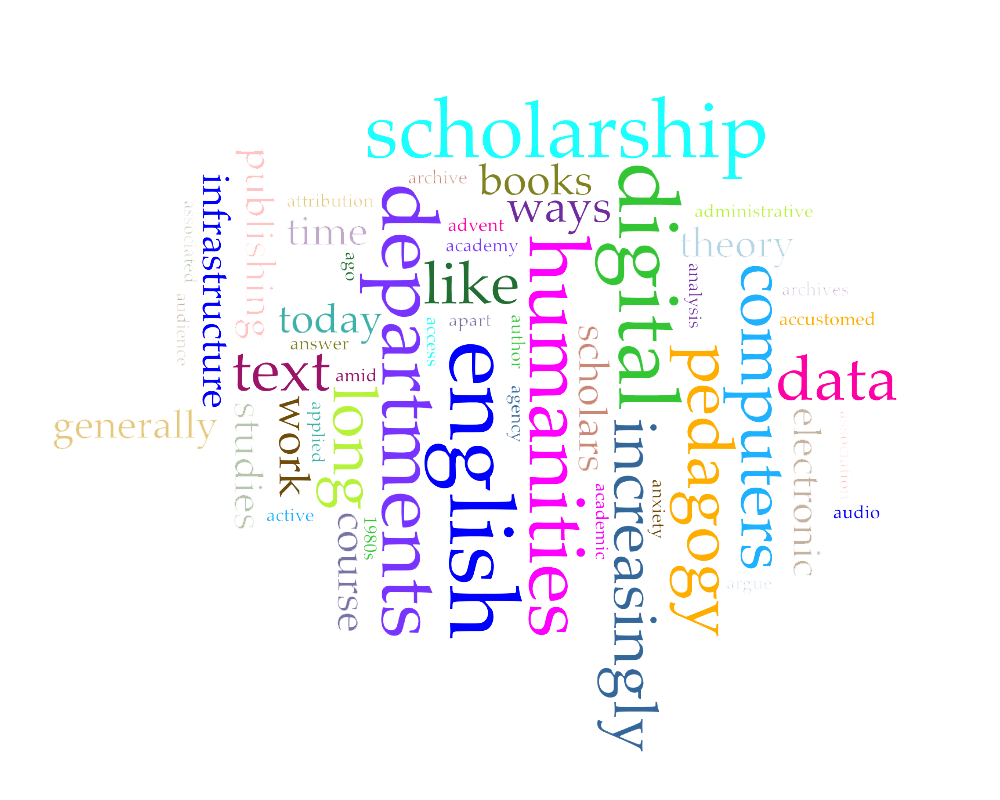
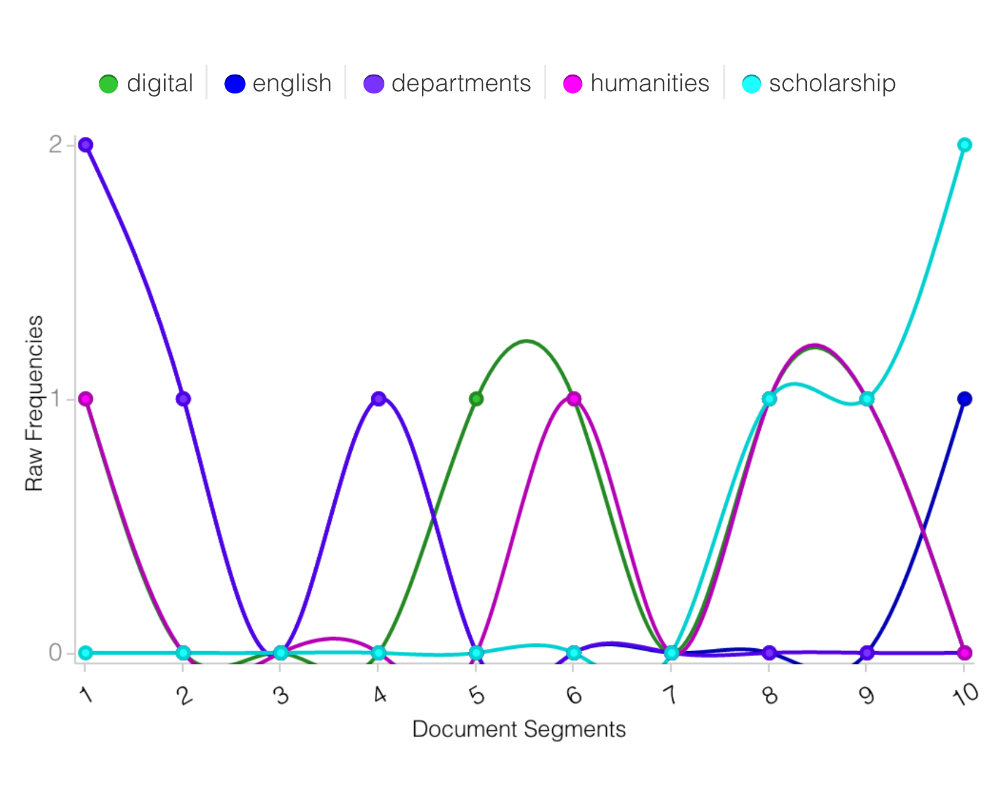

##### Jaeden Laffey
##### Alexander Christie
##### IASC 2P02
##### March 9th 2017

### Does Digital Humanities Belong in English Departments? - An Argumentative Response

Despite the title of the article, Kirschenbaum spends much of his writing setting a definition to Digital Humanities and describing how the name came to be.  He devotes only the last paragraph to discussing Digital Humanities place in English departments.  Kirschenbaum found a definition of Digital Humanities though Wikipedia as “a field of study, research, teaching, and invention concerned with the intersection of computing and the disciplines of the humanities.”  This description describes digital humanities well.  The field was originally referred to as “humanities computing”, but the name Digital Humanities better encapsulated the field as the name put more emphasis on the “humanities” aspect and creating a better image of the intersection between the two fields, moving away from implying the simple digitization of the humanities.  

Digital Humanities has been subjected to an influx in popularity over the past few years, and the field that “began as a term of consensus among a relatively small group of researchers, is now backed on a growing number of campuses by a level of funding, infrastructure, and administrative commitments that would have been unthinkable even a decade ago.” (Kirschenbaum).

After describing how Digital Humanities were established and the events that helped to shape the field, Kirschenbaum addresses the notion of including Digital Humanities in schools, particularly in the English department.  His main argument is that Digital Humanities do belong in English departments.  This is a statement that I agree with. I believe that the digital tools we have access to in this day and age have the ability to greatly help many students to learn more effectively and efficiently.  I would argue, however, that the inclusion of Digital Humanities could possess the ability to change the way English departments function dramatically.  With further integration of technology into the English department, changes could occur such as shifting from print books to e-books, libraries being turned into online archives, and school work being distributed and submitted all online.  This may be difficult to adapt to for less tech-savvy individuals, but will be easily adopted by the younger generation who have grown up with this technology.  As digital media literacy is becoming a bigger part of the classroom, this shift will make schooling much easier and more accessible for our younger students.

Further proof of Digital Humanities belonging in the English department is the inclusion of digital literacy as part of the curriculum for schools in Ontario.  The Toronto District School Board’s ICT (Information & Communication Technologies) Standards document sates that ICT can be “used for the enhancement of learning, communication, and creativity.” (TDSB).  This document serves as a guideline for the introduction of technology in classrooms and for students and teachers to utilize technology as a tool for teaching and learning. The document states that ICT is helpful and very important in the classroom because “the higher-order thinking skills of applying, analyzing, evaluating, and creating are developed when students integrate ICT tools to communicate within content areas of The Ontario Curriculum.”

Later in the article, Kirschenbaum gives a total of 6 examples of why and how Digital Humanities fits into the English department.  I found 2 of them to be particularly pertinent.

As I mentioned before, most of the article is spent discussing the history behind the  name Digital Humanities. For this reason I chose to analyse only the (long) paragraph in which Kirschenbaum argues for Digital Humanities in English departments using Voyant.  The illustrations that were generted are below.  

One of Kirschenbaum arguments is that the invention of “hypertext and other forms of electronic literature that continues to this day and is increasingly vibrant and diverse.”  This is another reason why the Digital Humanities fits into the English department.  This statement is certainly true.  Hypertext literature was a transformative electronic literary mode that used the interactivity of hypertext links to create a story that users could explore their way through the multiple potentials storylines. Hypertext stories are no longer as popular as they once were, but there could be a new form of (possibly interactive) literary media that could grow to be more popular than hypertext ever was, and could potentially shift the population from reading books to a new digital medium altogether.  With the advancement of technology and the use and inclusion of it in schools, it is possible for the younger generation to explore these new mediums and technologies in literature as well as creating their own new digital literary pieces through a collaboration of the Digital Humanities with the English department.  It is obvious to see that in our digital age, the way we read and write is starting to change.  Today, things like Twitter, blogs and online publishing are changing the way that we use the English language to communicate.  As Julia Flanders said in her reading The Productive Unease of 21st-century Digital Scholarship, “these products provide extended horizons of usage, and produce a generation of students (and eventually future scholars) for whom computers mean something completely different: for whom they are not a specialized tool but part of the tissue of the world.” With these services increasing in popularity and being taught to and utilized by a new generation of students, it will definitely be interesting to see what the next literary breakthrough may be.   

A second argument that Kirschenbaum makes is that the growing success of e-books and e-readers, as well other technology makes a strong case for inclusion in English departments.  He also states that the large-scale digitization projects such as Google Books or other online libraries and archives are very useful for the English department as well.  Large-scale digitization of books, records, and other historical literary artifacts is very important because of the fact that it gives scholars, teachers, and students easier access to a larger base of data, as well as digitally preserving important texts and documents to last much longer than the paper they were originally written on.  E-books and e-readers have become massively successful and are integral parts to explain why Digital Humanities belongs in English departments.   Similar to how the iPod digitized music, e-books and e-readers are doing the same thing for print.  According to a survey conducted by Nielson Bookscan, “e-books accounted for 15% of the spending on all new books in 2014, up from 12% in 2013” (Milliot).  On the other hand, “print accounted for 70% of new-book spending in 2014, a drop of seven percentage points from 2013” (Milliot).  Print is obviously not a dead medium by any means, but with the inclusion and steady advancement of technology in the literary fields, the growth of e-books and similar technologies may see an eventual takeover as the most popular literary form in the future.  For now however, they are still a medium on the rise.   

In the reading “Why are the Digital Humanities So White?” by Tara McPherson, she states that “First, we must better understand the machines and networks that continue to powerfully shape our lives in ways that we are often ill equipped to deal with as media and humanities scholars” (McPherson).    This quote captures the argument made by Kirschenbaum very well.  McPherson’s quote can be applied to the situation of Digital Humanities in English departments.  If students are exposed to and taught about technology and the Digital Humanities, they will gain a better understanding of the Digital Humanities and will be able to take full advantage of the communicative and expressive modes of technologies that will allow them to shape and create their own future.  

#### Works Cited

Kirschenbaum , Matthew. "What Is Digital Humanities and What’s It Doing in English Departments?" Debates in the Digital Humanities. N.p., n.d. Web. 27 Feb. 2017.

McPherson, Tara. "Why Are the Digital Humanities So White? or Thinking the Histories of Race and Computation." Debates in the Digital Humanities. N.p., n.d. Web. 01 Mar. 2017.

TDSB. “TDSB ICT Standards - Digital Learning for Kindergarten to Grade 12”. N.p.: n.p., 2007. Toronto District School Board. Web.

Milliot, Jim. "E-Books Gained, Online Retailers Slipped in 2014: New Nielsen Survey of Book-Buyers Found E-Books to Have a 15 % Share of Sales Last Year." Publishers Weekly, no. 13, 2015, p. 4. EBSCOhost, proxy.library.brocku.ca/login?url=http://search.ebscohost.com/login.aspx?direct=true&db=edsglr&AN=edsgcl.409069202&site=eds-live&scope=site.

Flanders, Julia. "The Productive Unease of 21st-century Digital Scholarship." The Productive Unease of 21st-century Digital Scholarship. Digital Humanities Quarterly, n.d. Web. 05 Mar. 2017.

[What Is Digital Humanities and What’s It Doing in English Departments?](http://dhdebates.gc.cuny.edu/debates/text/38)

### Blog Posts

[Continue Reading](README)

