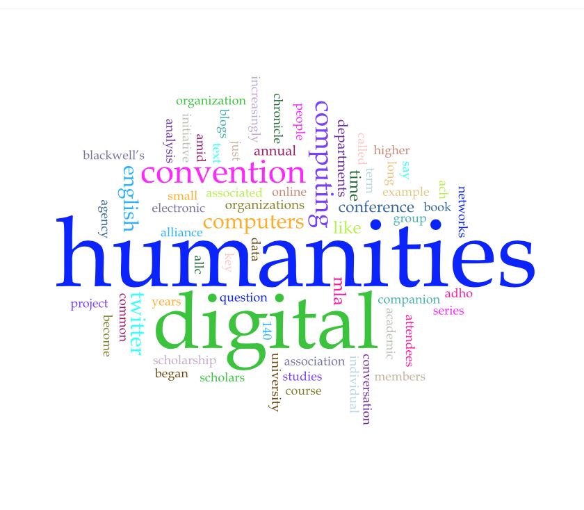

##### Jaeden Laffey
##### Alexander Christie
##### IASC 2P02
##### March 9th 2017

### Does Digital Humanities Belong in English Departments?

Lorem ipsum dolor sit amet, consectetur adipiscing elit. Nam sit amet eleifend massa. In quis leo a sapien imperdiet tempor. Morbi commodo velit id nulla fringilla, ac faucibus elit dictum. Aenean vestibulum nec metus sit amet accumsan. Pellentesque ornare tempus euismod. Vivamus viverra vitae massa vitae dictum. Sed vitae lorem euismod, semper massa eget, vestibulum risus. Aliquam erat volutpat. Vestibulum quis nisi sit amet leo venenatis volutpat. Etiam finibus sit amet diam vel dictum. Sed felis dui, pellentesque et faucibus ac, placerat ut felis.

[What Is Digital Humanities and What’s It Doing in English Departments?](http://dhdebates.gc.cuny.edu/debates/text/38)

Mauris placerat sem quis rhoncus pulvinar. Donec molestie dui porta magna lacinia, eget tincidunt dolor condimentum. Ut convallis faucibus nisi sit amet posuere. Donec aliquam leo arcu, vel commodo ante luctus sed. Pellentesque aliquam felis dapibus, euismod neque a, elementum ante. Aenean varius orci nec leo lobortis tincidunt. Proin ac pharetra nisl. Aenean in ornare felis, ac rutrum erat. Suspendisse potenti. Duis ac feugiat tellus. Ut fringilla ullamcorper sodales. Suspendisse egestas urna non est lacinia, eget cursus ipsum posuere. Aliquam sit amet augue posuere, accumsan lacus in, imperdiet tellus.

### Blog Posts

[Continue Reading](README)

